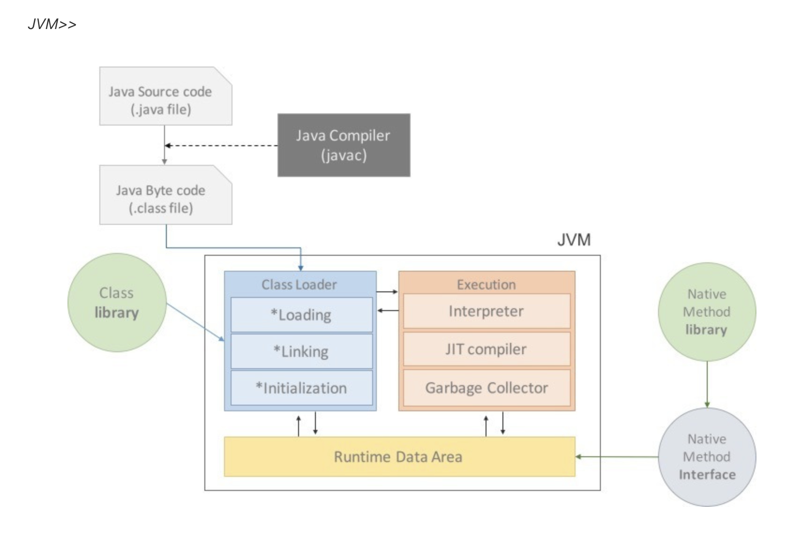

# Part Java

---
## JVM의 구조와 Java의 실행방식을 설명해주세요.
JVM은 자바 프로그램이 어느 운영체제에서나 동일하게 실행될 수 있도록 해주는 가상 실행 환경입니다. 
JVM의 주요 구성 요소는 크게 클래스로더, 실행 엔진, 런타임 데이터 영역, 네이티브 메서드 인터페이스가 있습니다. 
클래스로더(Class Loader)는 .class 파일을 메모리로 로드하여 실행 준비를 하는 역할을 합니다. 
실행 엔진(Execution Engine)은 바이트코드를 기계어로 변환하여 실행합니다.
런타임 데이터 영역(Runtime Data Area)은 JVM이 프로그램을 실행하는 동안 사용하는 메모리 영역입니다. 여기에는 메서드 영역(클래스 정보, static 변수 저장), 힙(객체 저장), 스택(메서드 호출 정보 저장), PC 레지스터, 네이티브 메서드 스택 등이 포함됩니다. 
네이티브 메서드 인터페이스(Native Method Interface)는 Java 외의 언어(C, C++ 등)로 작성된 네이티브 라이브러리를 호출할 수 있게 해주는 인터페이스입니다.

Java의 실행 방식은 개발자가 작성한 .java 소스 파일을 javac 컴파일러에 의해 .class 바이트코드로 변환시킵니다. 
그다음 Class Loader를 통해 .class 파일들을 JVM으로 로딩하고, 로딩된 class 파일들은 실행 엔진을 통해 해석됩니다. 
해석된 바이트코드는 런타임 데이터 영역에 배치되어 실질적인 수행이 이루어지고, 실행 중 생성된 객체는 힙 영역에 저장되며, 사용이 끝난 객체는 JVM의 가비지 컬렉터가 자동으로 메모리에서 해제합니다. 
결국 JVM은 Java 프로그램을 OS와 하드웨어에 독립적으로 실행시키고, 메모리 관리를 담당하며, 성능 최적화를 위해 가비지 컬렉션 같은 기능을 제공합니다.

> #### [참고]
> 